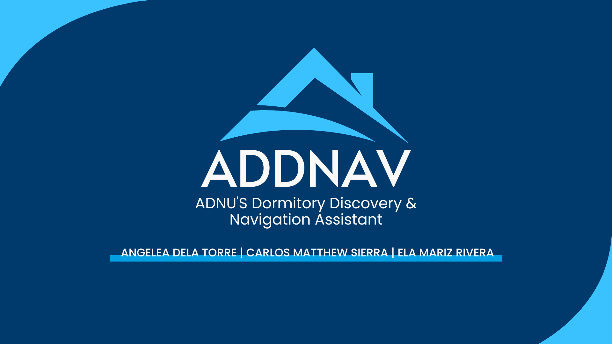

# ADDNAV Dormitory Finder Portal

A collaborative web application built to help students explore accredited dormitories near Ateneo de Naga University. This project focuses on a clean user interface and essential authentication features using Django and PostgreSQL.

## 👨‍💻 Contributors
- Ela Rivera (Team Leader, Front End Developer, UI/UX)
- Carlos Sierra (Backend Developer – Authentication, Database Integration)
- Angelea Dela Torre (UI/UX)

## 📝 Project Description

ADDNAV is a dormitory listing platform featuring a custom-designed landing page, login and sign-up functionality, and a homepage showcasing various accredited dormitories. The system was developed using Django and PostgreSQL, with HTML/CSS for frontend rendering.

## ⚙️ Mechanics & How to Use

1. **Landing Page**  
   - Navigate to the homepage to see the dormitory overview and access sign-up/login.

2. **Sign-Up**  
   - Users can register by providing their first name, last name, email, and password.
   - Data is securely saved into a PostgreSQL database.

3. **Login**  
   - Existing users can log in with their credentials.
   - Upon successful authentication, users are redirected to the homepage.

4. **Homepage**  
   - Displays a static dorm showcase.
   - Navigation bar links are placeholders for future functionality.

## 🛠 Technologies Used
- Django (Backend Framework)
- PostgreSQL (Database)
- HTML & CSS (Frontend)
- pgAdmin 4 (Database GUI)

## 🚧 Status

This is an early-stage implementation focused on core user authentication and frontend integration. Further features such as dorm search, admin panel, and dynamic listings are planned.

---

